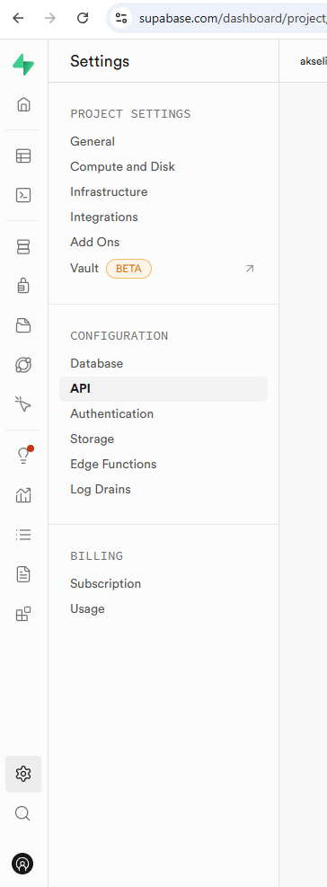
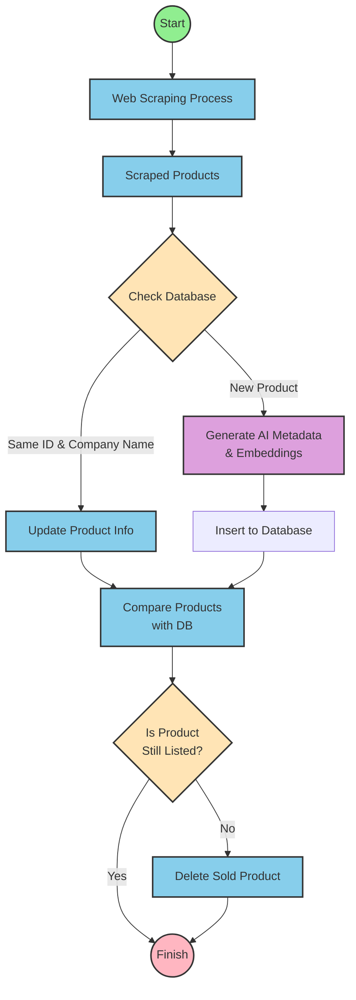

# Tavaratrading Embeddings

Semanttinen hakusovellus käytetyille huonekaluille, joka hyödyntää OpenAI:n embeddings-teknologiaa ja Supabasen vektorihakua. Sovellus web-screippaa huonekalut Tavaratrading-sivustolta ja mahdollistaa sisustussuunnittelijoille tarkan semanttisen haun.

## Ominaisuudet

- 🔍 Semanttinen haku OpenAI embeddings -teknologialla
- 🤖 Automaattinen web-scraping Puppeteer-kirjastolla
- 🎯 GPT-4 Vision -pohjainen tuoteanalyysi
- 🗄️ Vektorihaku Supabasella
- 🔐 Basic Auth -suojattu API

## Teknologiat

- Next.js 15 (App Router)
- TypeScript
- OpenAI API (GPT-4o & embeddings)
- Supabase (PostgreSQL + pgvector)
- Drizzle ORM
- Puppeteer
- TailwindCSS

## Alkuun pääseminen

### Ympäristön pystytys

1. Kloonaa repositorio:

```bash
git clone https://github.com/laguagu/tavaratrading-embeddings
cd tavaratrading-embeddings
```

2. Asenna riippuvuudet:

```bash
npm install
```

3. Aseta ympäristömuuttujat:

```bash
cp .env.example .env.local
```

## Supabase asetukset

Supabase ympäristömuuttujat saat haettua kun olet luonut projektin [Supabase](https://supabase.com/):sta:



Tarvittavat ympäristömuuttujat Supabasen "Project Settings" valikosta:

- `DATABASE_URL`: Löytyy kohdasta "Database" -> "Connection string"
- `SUPABASE_PRIVATE_KEY` / `NEXT_PUBLIC_SUPABASE_ANON_KEY`: Löytyy kohdasta "API" -> "anon/public"
- `NEXT_PUBLIC_SUPABASE_URL`: Löytyy kohdasta "API" -> "Project URL"

### Kehitys

1. Käynnistä kehityspalvelin:

```bash
npm run dev
```

2. Avaa [http://localhost:3000](http://localhost:3000)

# Tietokannan alustus (ellei ole tehty)

### 1. Drizzle migraatiot

1. Luo tietokantamigraatiot ja/tai pushaa schema muutokset:

```bash
# Luo migraatiotiedostot
npm run db:generate

# Aja migraatiot
npm run db:migrate

# TAI pushaa schema muutokset suoraan (kehitysympäristössä)
npm run db:push
```

2. (Valinnainen) Käynnistä Drizzle Studio tietokannan hallintaan:

```bash
npm run db:studio
```

### 2. PostgreSQL Laajennukset ja Indeksit

Supabasessa täytyy ensin luoda tarvittavat laajennukset ja indeksit:

**Avaa SQL-Editor**

Aja seuraava SQL loitsu editorissa. Tämä luo funktion semanttista hakua varten, sekä indeksin.

```sql
-- Vektorilaajennuksen aktivointi
create extension if not exists vector;

DROP FUNCTION IF EXISTS test_match_furnitures_with_filter(vector,double precision,integer,jsonb);

CREATE OR REPLACE FUNCTION test_match_furnitures_with_filter (
  query_embedding vector(1536),
  match_threshold float,
  match_count int,
  filter jsonb DEFAULT '{}'::jsonb
)
RETURNS TABLE (
  id text,
  name text,
  price decimal,
  image_url text,
  product_url text,
  condition text,
  metadata jsonb,
  similarity float,
  company text
)
LANGUAGE plpgsql AS $$
DECLARE
  color_filter jsonb := filter -> 'colors';
  metadata_filter jsonb := filter - 'colors';
BEGIN
  RETURN QUERY
  SELECT
    test_products.id,
    test_products.name,
    test_products.price::decimal,
    test_products.image_url,
    test_products.product_url,
    test_products.condition,
    test_products.metadata,
    1 - (test_products.embedding <=> query_embedding) as similarity,
    test_products.company
  FROM test_products
  WHERE 1 - (test_products.embedding <=> query_embedding) > match_threshold
    AND (
      filter = '{}'::jsonb
      OR (
        -- Tarkista muut metadata-kentät paitsi värit
            test_products.metadata @> metadata_filter
        AND
        -- Tarkista värit: palauta true jos yksikin väri täsmää
        (
          color_filter IS NULL
          OR EXISTS (
            SELECT 1
            FROM jsonb_array_elements_text(color_filter) AS filter_color
            WHERE filter_color IN (
              SELECT jsonb_array_elements_text(test_products.metadata -> 'colors')
            )
          )
        )
      )
    )
  ORDER BY similarity DESC
  LIMIT match_count;
END;
$$;

create index idx_test_products_metadata on test_products using gin (metadata);
```

### Web Scraping

Sovellus tukee web scraping -toiminnallisuutta API endpointin kautta:

**API endpoint** (/api/scrape):

- POST: Manuaalinen scraping valituille URL:eille
- Basic Auth -autentikointi
- Toimii vain kehitysympäristössä. Tuotannossa estetty [middleware.ts](./middleware.ts)
- Jos et anna post pyynnössä parametrejä käytetään vakioasetuksina screippaukseen.

```javascript
const urlsToProcess = options?.urls || PRODUCT_URLS;
const productsPerUrl = options?.productsPerUrl || 70;
```

#### API käyttö esimerkki:

```bash
# Manuaalinen scraping
curl -X POST http://localhost:3000/api/scrape \
  -u "username:password" \
  -H "Content-Type: application/json" \
  -d '{"urls": ["https://www.tavaratrading.com/..."], "productsPerUrl": 10}'
```

## Projektin rakenne

```
.
├── app/                # Next.js App Router
│   ├── api/           # API endpoints
│   └── page.tsx       # Päänäkymä
├── lib/               # Sovelluksen ydinlogiikka
│   ├── ai/           # OpenAI integraatiot
│   ├── db/           # Tietokantaoperaatiot
│   ├── scripts/      # Skriptit (scraper)
│   └── types.ts      # TypeScript tyypit
└── components/        # React komponentit
```

## Kubernetes konfiguraatiot

Projektista löytyy Kubernetes-konfiguraatiot `lib/kubernetes/` kansiosta:

```bash
lib/kubernetes/
├── cronjobs/
│   └── scraper-weekly.yaml      # Viikoittainen scraping-ajo (maanantaisin klo 00:00)
└── jobs/
    └── scraper-manual.yaml      # Template manuaalista ajoa varten
```

## Tietokantarakenne

Sovellus käyttää PostgreSQL:ää pgvector-laajennuksella vektorihakuun. Tietokannan schema on määritelty Drizzle ORM:llä:

```typescript
export const products = pgTable(
  "test_products", // Käytetään testi taulua, koska saatu parempia tuloksia tällä. ( Erillainen embedding arvo. Paranneltu generateEmbedding funktiota ja skeeman kuvauksia verrattuna products tauluun )
  {
    uniqueId: uuid("unique_id").defaultRandom().primaryKey(),
    id: text("id").notNull(),
    name: text("name").notNull(),
    description: text("description"),
    price: decimal("price", { precision: 10, scale: 2 }),
    condition: text("condition"),
    imageUrl: text("image_url"),
    productUrl: text("product_url"),
    category: text("category"),
    availability: text("availability"),
    company: text("company").notNull(),
    isTestData: boolean("is_test_data").default(false),
    metadata: jsonb("metadata").$type<ProductMetadata>().notNull(), // GPT-4o generoi tämän scheman perusteella.
    embedding: vector("embedding", { dimensions: 1536 }),
    searchTerms: text("search_terms"),
    createdAt: timestamp("created_at").default(sql`NOW()`),
    updatedAt: timestamp("updated_at").default(sql`NOW()`),
  },
  (table) => [uniqueIndex("unique_product_source").on(table.id, table.company)],
);
```

### Huomioita tietokannoista:

Sovellus tukee kahta tietokantaa: tuotanto- ja testitietokantaa. Tietokannan voi vaihtaa muokkaamalla `lib/db/config.ts` tiedostoa:

```typescript
export const dbConfig = {
  useTestDb: true, // true = test_products, false = products
  getTable() {
    return this.useTestDb ? test_products : products;
  },
  getQueryHelper() {
    return this.useTestDb ? db.query.test_products : db.query.products;
  },
  getMatchFunction() {
    return this.useTestDb
      ? "test_match_furnitures_with_filter"
      : "match_furnitures_with_filter";
  },
};
```

- Tällä hetkellä käytössä on test_products taulu, koska sen avulla on saatu parempia tuloksia semanttisessa haussa
- Vaihto vaikuttaa sekä:
  - Drizzle ORM:n käyttämään tauluun (products/test_products)
  - Supabasen RPC-funktioon (match_furnitures_with_filter/test_match_furnitures_with_filter)
- Molemmat tietokannat käyttävät saman tyyppistä skeemaa, vain taulun nimi ja funktiot vaihtuvat.
- Mikäli halutaan vaihtaa taulua product tauluun joudutaan luomaan myös Supabaseen uusi funktio korvaamaan test_match_furnitures_with_filter jossa vaihdetaan kentät test_products -> products

### Tärkeimmät kentät:

- `metadata`: JSON-kenttä joka sisältää tuotteen analysoidut tiedot (tyyli, materiaalit, värit, jne.)
- `embedding`: 1536-dimensioinen vektori semanttista hakua varten

## Huomioita kehittäjille

- Tarvitset Supabase tilin
- Supabase projektin pitää tukea pgvector-laajennusta
- Tarvitset OpenAI api avaimen

## Semanttinen haku

Sovellus käyttää OpenAI:n text-embedding-3-small -mallia muuntamaan sekä tuotteet että käyttäjän hakutekstin vektoreiksi. Hakuprosessi toimii seuraavasti:

1. **Käyttäjän syöte:**

```typescript
// app/page.tsx
export default function TavaraTradingSearch() {
  async function handleSearch(formData: FormData) {
    const searchQuery = formData.get("query") as string;
    const searchResults = await searchFurniture(searchQuery, {
      minSimilarity: 0.25, // Alla tämän arvon olevat tulokset eivät tule mukaan
      maxResults: 6, // Montako tuotetta näytetään
      filters: {}, // Filtteröintiin mitkä annetaan match_furnitures_with_filter funktiolle mahdolliseen suodatukseen.
    });
    // ...
  }
}
```

2. **Hakutekstin muuntaminen vektoriksi:**

```typescript
// app/actions.ts
export async function generateSearchEmbedding(
  searchText: string, // Käyttäjän hakusana
): Promise<number[]> {
  const response = await openai.embeddings.create({
    model: "text-embedding-3-small", // OpenAI embedding malli
    input: searchText,
    encoding_format: "float",
  });
  return response.data[0].embedding; // Vektori
}
```

3. **Samankaltaisuushaku tietokannasta:**

```typescript
export async function searchFurniture(
  searchQuery: string,
  options: {
    minSimilarity?: number;
    maxResults?: number;
  } = {},
) {
  const embedding = await generateSearchEmbedding(searchQuery);
  const { data } = await supabase.rpc("match_furnitures_with_filter", {
    query_embedding: embedding,
    match_threshold: minSimilarity,
    match_count: maxResults,
  });
  return data;
}
```

### Hakuprosessin kulku:

1. Käyttäjä kirjoittaa hakulauseen (esim. "moderni valkoinen työtuoli")
2. Hakulause muunnetaan 1536-dimensioiseksi vektoriksi OpenAI:n embeddings API:lla
3. Supabase vertaa tätä vektoria tietokannassa oleviin tuotteiden vektoreihin
4. Palautetaan samankaltaisimmat tuotteet cosine similarity -arvon perusteella
5. Tulokset järjestetään samankaltaisuuden mukaan

### Web Scraping -prosessi

Web scraping -prosessin kulku on kuvattu alla olevassa kaaviossa:



### Web Scraping huomiot

- Test scripteillä (`test:scraper` ja `test:pipeline`) voi testata scraping-toiminnallisuutta paikallisesti
- Käytä testeihin erillistä tietokantaa tuotantotietokannan sijaan
- Muista asettaa Basic Auth -tunnukset ympäristömuuttujiin

# Kustannusarvio

Sovelluksen käyttökustannukset koostuvat pääasiassa OpenAI API -kutsuista:

## GPT-4o Vision -analyysit (kuvien prosessointi)

- Noin $0.0007 per analysoitu tuotekuva
- Sisältää tuotteen tyylin, materiaalien ja värien tunnistuksen (metadata objektin) jne.

## Embeddings (semanttinen haku)

- text-embedding-3-small: $0.02 per 1M tokenia
- Hakukustannukset ovat minimaaliset, tyypillisesti alle $0.0001 per haku

## Kokonaiskustannusarvio

- 100 tuotteen prosessointi: ~$0.07
- 1000 hakua: ~$0.10
- Kuukausittainen kustannusarvio normaalikäytöllä: $1-5

_Huom: Kustannukset ovat arvioita ja voivat vaihdella käyttömäärän mukaan._

## Lisenssi

MIT License - katso [LICENCE](LICENCE) tiedosto lisätietoja varten.

## Sovelluksen vieminen Rahtiin

Sovelluksen tai uuden version vieminen Rahtiin onnistuu seuraamalla [pushToRahti.txt](../lib/docs/pushToRahti.txt) tiedostossa olevia ohjeita. Tiedosto sisältää tarvittavat komennot ja vaiheet, jotka tulee suorittaa mikäli uuden lokaalin version haluaa viedä Rahti 2 palveluun.

## Kehitysideoita

Generoi embedding arvot eri embedding llm malleilla ja vertaile. Tässä hetkellä siis käytössä OpenAI mallit.
Käytä reranking llm mallia tulosten järjestykseen. ("Tämä luultavasti paras vaihtoehto ja helpoin tehdä")
